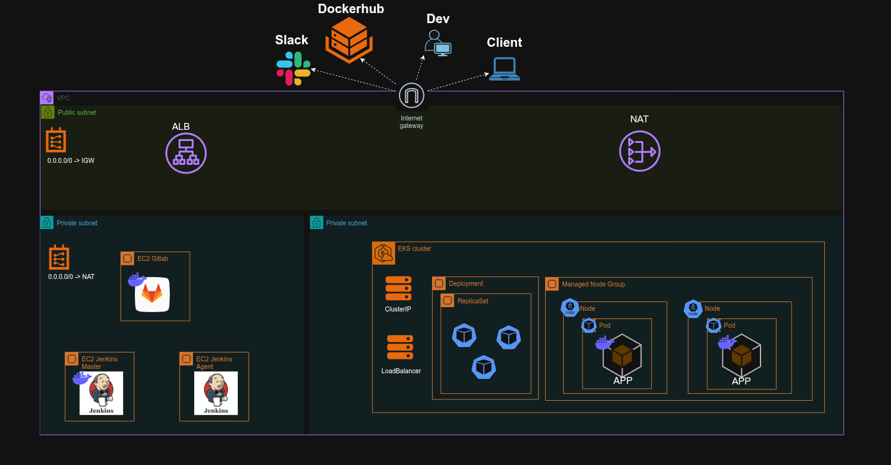

# DevOps Infrastructure Project

<div align="center">


**A Production-Ready Cloud Infrastructure with Full CI/CD Pipeline**

[Architecture](#architecture) •
[Features](#features) •
[Prerequisites](#prerequisites) •
[Quick Start](#quick-start) •
[Documentation](#documentation)

</div>

---

## 📋 Table of Contents

- [Overview](#overview)
- [Architecture](#architecture)
- [Core Components](#core-components)
- [Features](#features)
- [Prerequisites](#prerequisites)
- [Installation](#installation)
- [Configuration](#configuration)
- [Deployment](#deployment)
- [Monitoring & Observability](#monitoring--observability)
- [CI/CD Pipeline](#cicd-pipeline)
- [Security](#security)
- [Troubleshooting](#troubleshooting)
- [Contributing](#contributing)
- [License](#license)

---

## 🎯 Overview

This project demonstrates a complete DevOps infrastructure implementation using modern cloud-native technologies. It showcases best practices in infrastructure as code, container orchestration, continuous integration/continuous deployment, and comprehensive monitoring.

The infrastructure is designed to be scalable, highly available, and production-ready, featuring automated deployments, self-healing capabilities, and comprehensive observability.

### Key Highlights

- **Infrastructure as Code**: Complete infrastructure provisioning using Terraform
- **Container Orchestration**: Kubernetes cluster (EKS) for application deployment
- **CI/CD Pipeline**: Automated build, test, and deployment workflows
- **Monitoring Stack**: Full observability with Prometheus and custom metrics
- **Secret Management**: Secure credential storage with HashiCorp Vault
- **GitOps**: Version-controlled infrastructure and application deployments
- **Multi-Environment**: Support for development, staging, and production environments

---

## 🏗️ Architecture



### Network Architecture

The infrastructure is deployed across multiple availability zones for high availability:

```
VPC (10.0.0.0/16)
│
├── Public Subnets (Internet-facing)
│   ├── NAT Gateways
│   ├── Application Load Balancer
│   └── Bastion Host (optional)
│
└── Private Subnets (Internal)
    ├── EKS Cluster
    │   ├── Control Plane (Managed by AWS)
    │   └── Worker Nodes
    │       ├── Application Pods
    │       ├── System Services
    │       └── Monitoring Stack
    │
    ├── CI/CD Infrastructure
    │   ├── GitLab Server
    │   ├── Jenkins Controller
    │   └── Jenkins Agents
    │
    └── Supporting Services
        ├── Prometheus (Metrics)
        ├── Vault (Secrets)
        └── External DNS Controller
```

---

## 🔧 Core Components

### Infrastructure Layer

| Component | Technology | Purpose |
|-----------|-----------|---------|
| **Cloud Provider** | AWS | Hosting platform for all infrastructure |
| **IaC Tool** | Terraform | Infrastructure provisioning and management |
| **Container Registry** | Docker Hub | Storage for container images |
| **Networking** | AWS VPC | Isolated network environment with public/private subnets |

### Kubernetes Layer

| Component | Technology | Purpose |
|-----------|-----------|---------|
| **Orchestration** | Amazon EKS | Managed Kubernetes service |
| **Load Balancer** | AWS ALB Controller | Automatic ingress and load balancing |
| **DNS Management** | External DNS Controller | Automatic Route53 record management |
| **Elastic Storage** | EBS Controller | Dynamic persistent volume provisioning |

### Application Layer

| Application | Description | Access |
|------------|-------------|--------|
| **Weather App 01** | Sample microservice application | `https://weather-app.example.com` |
| **Weather App 02** | Secondary instance for testing | `https://weather-app-v2.example.com` |

### CI/CD Layer

| Component | Technology | Purpose |
|-----------|-----------|---------|
| **Source Control** | GitLab Server | Git repository and version control |
| **CI/CD Engine** | Jenkins | Automated build and deployment pipelines |
| **Jenkins Controller** | Jenkins Master | Pipeline orchestration and management |
| **Jenkins Agents** | Dynamic Agents | Distributed build execution |
| **Bastion Server** | Linux Jump Host | Secure access to private resources |

### Observability Layer

| Component | Technology | Purpose |
|-----------|-----------|---------|
| **Metrics** | Prometheus | Time-series metrics collection and storage |
| **Visualization** | Grafana (planned) | Metrics visualization and dashboards |
| **Alerting** | Prometheus Alertmanager | Alert routing and notifications |
| **Notifications** | Slack Integration | Real-time alerts and notifications |

### Security Layer

| Component | Technology | Purpose |
|-----------|-----------|---------|
| **Secrets Management** | HashiCorp Vault | Centralized secret storage and encryption |
| **Authentication** | IAM + IRSA | Role-based access control |
| **Network Security** | Security Groups | Firewall rules and network segmentation |
| **Encryption** | AWS KMS | Data encryption at rest and in transit |

---

## ✨ Features

### Infrastructure Features

- ✅ **Multi-AZ Deployment**: High availability across multiple availability zones
- ✅ **Auto Scaling**: Automatic scaling based on metrics and demand
- ✅ **Self-Healing**: Automatic pod restart and node replacement
- ✅ **Blue-Green Deployments**: Zero-downtime deployments
- ✅ **Disaster Recovery**: Automated backups and restore procedures
- ✅ **Cost Optimization**: Right-sized resources with auto-scaling

### DevOps Features

- ✅ **GitOps Workflow**: Git as single source of truth
- ✅ **Automated Testing**: Unit, integration, and end-to-end tests
- ✅ **Infrastructure Validation**: Terraform plan and validation in CI
- ✅ **Rollback Capability**: Quick rollback to previous versions
- ✅ **Environment Parity**: Consistent environments across dev/staging/prod
- ✅ **Immutable Infrastructure**: Replaceable infrastructure components

### Monitoring Features

- ✅ **Real-time Metrics**: Live monitoring of infrastructure and applications
- ✅ **Custom Dashboards**: Grafana dashboards for different stakeholders
- ✅ **Alerting Rules**: Proactive alerting for critical issues
- ✅ **Log Aggregation**: Centralized logging (planned)
- ✅ **Distributed Tracing**: Request tracing across services (planned)
- ✅ **Slack Integration**: Real-time notifications to team channels

### Security Features

- ✅ **Encrypted Communication**: TLS/SSL for all external communications
- ✅ **Secret Rotation**: Automated credential rotation
- ✅ **Principle of Least Privilege**: Minimal required permissions
- ✅ **Network Isolation**: Private subnets for sensitive workloads
- ✅ **Audit Logging**: Comprehensive audit trail
- ✅ **Vulnerability Scanning**: Container image scanning (planned)

---

## 📦 Prerequisites

### Required Tools

Ensure you have the following tools installed:

| Tool | Version | Purpose | Installation |
|------|---------|---------|--------------|
| **Terraform** | >= 1.6.0 | Infrastructure provisioning | [Download](https://www.terraform.io/downloads) |
| **kubectl** | >= 1.28.0 | Kubernetes CLI | [Download](https://kubernetes.io/docs/tasks/tools/) |
| **AWS CLI** | >= 2.13.0 | AWS command line interface | [Download](https://aws.amazon.com/cli/) |
| **Docker** | >= 24.0.0 | Container runtime | [Download](https://docs.docker.com/get-docker/) |
| **Helm** | >= 3.12.0 | Kubernetes package manager | [Download](https://helm.sh/docs/intro/install/) |
| **Git** | >= 2.40.0 | Version control | [Download](https://git-scm.com/downloads) |

### AWS Account Requirements

- Active AWS account with administrative access
- AWS credentials configured locally (`~/.aws/credentials`)
- Sufficient service limits for:
  - VPC (1 VPC)
  - Elastic IPs (3 minimum for NAT gateways)
  - EKS clusters (1)
  - EC2 instances (10+ for worker nodes)
  - Elastic Load Balancers (2+)

### Domain Requirements

- Registered domain name for application access
- Route53 hosted zone (or ability to delegate DNS)
- SSL/TLS certificate (can be provisioned via ACM)

### Third-Party Accounts

- **Docker Hub Account**: For pulling/pushing container images
- **Slack Workspace**: For receiving notifications (optional)
- **GitLab Account**: If using GitLab.com instead of self-hosted (optional)

---

## 🚀 Installation

### Step 1: Clone the Repository

```bash
git clone https://github.com/your-username/devops-infrastructure.git
cd devops-infrastructure
```

### Step 2: Configure AWS Credentials

```bash
aws configure
# Enter your AWS Access Key ID, Secret Access Key, and default region
```

Verify your credentials:

```bash
aws sts get-caller-identity
```

### Step 3: Initialize Terraform Backend

Create an S3 bucket for Terraform state:

```bash
aws s3 mb s3://your-terraform-state-bucket --region us-east-1
aws s3api put-bucket-versioning \
  --bucket your-terraform-state-bucket \
  --versioning-configuration Status=Enabled
```

Create a DynamoDB table for state locking:

```bash
aws dynamodb create-table \
  --table-name terraform-state-lock \
  --attribute-definitions AttributeName=LockID,AttributeType=S \
  --key-schema AttributeName=LockID,KeyType=HASH \
  --billing-mode PAY_PER_REQUEST \
  --region us-east-1
```

### Step 4: Configure Variables

Create a `terraform.tfvars` file:

```bash
cp terraform.tfvars.example terraform.tfvars
```

Edit `terraform.tfvars` with your specific values:

```hcl
# Project Configuration
project_name = "devops-course"
environment  = "production"
region       = "us-east-1"

# Network Configuration
vpc_cidr            = "10.0.0.0/16"
availability_zones  = ["us-east-1a", "us-east-1b", "us-east-1c"]
public_subnet_cidrs = ["10.0.1.0/24", "10.0.2.0/24", "10.0.3.0/24"]
private_subnet_cidrs = ["10.0.11.0/24", "10.0.12.0/24", "10.0.13.0/24"]

# EKS Configuration
cluster_version = "1.28"
node_instance_types = ["t3.medium"]
node_desired_size   = 3
node_min_size       = 2
node_max_size       = 10

```

---

## ⚙️ Configuration

### Terraform Module Structure

```
terraform/
├── main.tf                 # Main configuration
├── variables.tf            # Input variables
├── outputs.tf              # Output values
├── versions.tf             # Provider versions
├── backend.tf              # Remote state configuration
│
└── environments/
    ├── dev/
    ├── staging/
    └── production/
```

### Backend Configuration

Update `backend.tf`:

```hcl
terraform {
  backend "s3" {
    bucket         = "your-terraform-state-bucket"
    key            = "devops-course/terraform.tfstate"
    region         = "us-east-1"
    encrypt        = true
    dynamodb_table = "terraform-state-lock"
  }
}
```

### Provider Configuration

The project uses the following Terraform providers:

```hcl
terraform {
  required_version = ">= 1.6.0"

  required_providers {
    aws = {
      source  = "hashicorp/aws"
      version = "~> 5.0"
    }
    kubernetes = {
      source  = "hashicorp/kubernetes"
      version = "~> 2.23"
    }
    helm = {
      source  = "hashicorp/helm"
      version = "~> 2.11"
    }
  }
}
```

---

## 🚢 Deployment

### Complete Infrastructure Deployment

#### 1. Initialize Terraform

```bash
cd terraform
terraform init
```

#### 2. Plan Infrastructure Changes

```bash
terraform plan -out=tfplan
```

Review the plan carefully to ensure all resources are correct.

#### 3. Apply Infrastructure

```bash
terraform apply tfplan
```

This will provision:
- VPC with public and private subnets
- NAT Gateways and Internet Gateway
- EKS cluster with managed node groups
- AWS Load Balancer Controller
- External DNS Controller
- Prometheus monitoring stack
- Vault for secrets management
- GitLab and Jenkins servers
- Security groups and IAM roles

**Estimated deployment time**: 15-20 minutes

#### 4. Configure kubectl

```bash
aws eks update-kubeconfig --name devops-course-cluster --region us-east-1
```

Verify cluster access:

```bash
kubectl get nodes
kubectl get pods --all-namespaces
```

#### 5. Deploy Sample Applications

```bash
kubectl apply -f k8s-manifests/weather-app-01.yaml
kubectl apply -f k8s-manifests/weather-app-02.yaml
```

#### 6. Verify Deployments

Check application status:

```bash
kubectl get ingress
kubectl get services
kubectl get pods -l app=weather-app
```

---

## 📊 Monitoring & Observability

### Accessing Prometheus

Prometheus is deployed within the cluster. To access it:

```bash
kubectl port-forward -n monitoring svc/prometheus-server 9090:80
```

Access at: `http://localhost:9090`

### Key Metrics to Monitor

| Metric | Description | Alert Threshold |
|--------|-------------|-----------------|
| `node_cpu_usage` | CPU utilization per node | > 80% |
| `node_memory_usage` | Memory utilization per node | > 85% |
| `pod_restart_count` | Number of pod restarts | > 3 in 10min |
| `http_request_duration` | API response times | > 500ms (p95) |
| `container_errors` | Container error rate | > 1% |

### Setting Up Slack Notifications

1. Create a Slack webhook URL in your workspace
2. Update the `slack_webhook_url` in `terraform.tfvars`
3. Apply Terraform changes:

```bash
terraform apply -var="slack_webhook_url=https://hooks.slack.com/services/YOUR/WEBHOOK"
```

4. Test notifications:

```bash
kubectl run test-alert --image=alpine --restart=Never -- /bin/sh -c "exit 1"
```

### Viewing Logs

```bash
# Application logs
kubectl logs -l app=weather-app --tail=100 -f

# Prometheus logs
kubectl logs -n monitoring -l app=prometheus --tail=100 -f

# Jenkins logs
kubectl logs -n ci-cd -l app=jenkins-controller --tail=100 -f
```

---

## 🔄 CI/CD Pipeline

### Pipeline Architecture

```
Developer Push → GitLab → Webhook → Jenkins → Build → Test → Deploy → Notify
                    ↓                            ↓       ↓       ↓       ↓
                  Source                      Docker   K8s   Smoke   Slack
                  Control                      Hub    Cluster Tests
```

### Jenkins Pipeline Stages

```groovy
pipeline {
    agent {
        kubernetes {
            label 'jenkins-agent'
        }
    }
    
    stages {
        stage('Checkout') {
            steps {
                checkout scm
            }
        }
        
        stage('Build') {
            steps {
                sh 'docker build -t weather-app:${BUILD_NUMBER} .'
            }
        }
        
        stage('Test') {
            steps {
                sh 'docker run weather-app:${BUILD_NUMBER} npm test'
            }
        }
        
        stage('Push to Registry') {
            steps {
                withCredentials([usernamePassword(credentialsId: 'dockerhub')]) {
                    sh 'docker push weather-app:${BUILD_NUMBER}'
                }
            }
        }
        
        stage('Deploy to K8s') {
            steps {
                sh 'kubectl set image deployment/weather-app app=weather-app:${BUILD_NUMBER}'
            }
        }
        
        stage('Smoke Tests') {
            steps {
                sh './scripts/smoke-tests.sh'
            }
        }
    }
    
    post {
        success {
            slackSend color: 'good', message: "Deployment Successful: ${env.JOB_NAME} #${env.BUILD_NUMBER}"
        }
        failure {
            slackSend color: 'danger', message: "Deployment Failed: ${env.JOB_NAME} #${env.BUILD_NUMBER}"
        }
    }
}
```

### Accessing Jenkins

```bash
# Port forward to Jenkins
kubectl port-forward -n ci-cd svc/jenkins-controller 8080:8080

# Get initial admin password
kubectl exec -n ci-cd jenkins-controller-0 -- cat /var/jenkins_home/secrets/initialAdminPassword
```

Access at: `http://localhost:8080`

### GitLab Configuration

GitLab is configured with:
- Automatic Jenkins webhooks
- Protected branches (main, develop)
- Merge request requirements
- CI/CD variables stored in Vault

### Deployment Workflow

1. Developer creates feature branch
2. Commits code and pushes to GitLab
3. GitLab webhook triggers Jenkins pipeline
4. Jenkins builds Docker image
5. Runs automated tests
6. Pushes image to Docker Hub
7. Updates Kubernetes deployment
8. Runs smoke tests
9. Sends notification to Slack

---

## 🔒 Security

### Security Best Practices Implemented

#### Network Security
- ✅ Private subnets for all workloads
- ✅ Public subnets only for load balancers
- ✅ Security groups with least privilege
- ✅ NACLs for additional network filtering
- ✅ VPC Flow Logs enabled

#### Access Control
- ✅ IAM roles with minimal permissions
- ✅ IRSA (IAM Roles for Service Accounts)
- ✅ No long-lived credentials
- ✅ MFA required for human access
- ✅ Service accounts for automation

#### Data Protection
- ✅ Encryption at rest (EBS, S3)
- ✅ Encryption in transit (TLS 1.2+)
- ✅ Secrets stored in Vault
- ✅ Automated secret rotation
- ✅ KMS for key management

#### Monitoring & Auditing
- ✅ CloudTrail for API logging
- ✅ GuardDuty for threat detection
- ✅ Security Hub for compliance
- ✅ Prometheus alerts for anomalies

### Accessing HashiCorp Vault

```bash
# Port forward to Vault
kubectl port-forward -n vault svc/vault 8200:8200

# Get root token
kubectl exec -n vault vault-0 -- vault operator init

# Login to Vault
export VAULT_ADDR='http://localhost:8200'
vault login <root-token>
```

### Storing Secrets in Vault

```bash
# Store a secret
vault kv put secret/weather-app api-key=your-api-key db-password=your-password

# Retrieve a secret
vault kv get secret/weather-app
```

### Rotating Credentials

```bash
# Rotate database password
./scripts/rotate-db-credentials.sh

# Rotate API keys
./scripts/rotate-api-keys.sh
```

---

## 🔧 Troubleshooting

### Common Issues and Solutions

#### EKS Cluster Not Accessible

**Symptom**: `kubectl` commands fail with connection timeout

**Solution**:
```bash
# Update kubeconfig
aws eks update-kubeconfig --name devops-course-cluster --region us-east-1

# Verify IAM permissions
aws eks describe-cluster --name devops-course-cluster

# Check security group rules
aws ec2 describe-security-groups --group-ids sg-xxxxx
```

#### Pods Not Starting

**Symptom**: Pods stuck in `Pending` or `CrashLoopBackOff`

**Solution**:
```bash
# Check pod events
kubectl describe pod <pod-name>

# Check logs
kubectl logs <pod-name> --previous

# Check resource availability
kubectl top nodes
kubectl describe nodes
```

#### Load Balancer Not Creating

**Symptom**: Ingress created but no ALB provisioned

**Solution**:
```bash
# Check ALB controller logs
kubectl logs -n kube-system deployment/aws-load-balancer-controller

# Verify IAM permissions
aws iam get-role --role-name AmazonEKSLoadBalancerControllerRole

# Check ingress annotations
kubectl describe ingress <ingress-name>
```

#### External DNS Not Updating Route53

**Symptom**: DNS records not created automatically

**Solution**:
```bash
# Check External DNS logs
kubectl logs -n kube-system deployment/external-dns

# Verify Route53 permissions
aws route53 list-hosted-zones

# Check service/ingress annotations
kubectl get ingress -o yaml
```

#### Prometheus Not Collecting Metrics

**Symptom**: No data in Prometheus UI

**Solution**:
```bash
# Check Prometheus targets
kubectl port-forward -n monitoring svc/prometheus-server 9090:80
# Navigate to http://localhost:9090/targets

# Check ServiceMonitor configuration
kubectl get servicemonitors -n monitoring

# Verify network policies
kubectl get networkpolicies -n monitoring
```

#### Jenkins Build Failures

**Symptom**: Pipeline fails at specific stage

**Solution**:
```bash
# Check Jenkins logs
kubectl logs -n ci-cd jenkins-controller-0

# Verify credentials
kubectl get secrets -n ci-cd

# Check agent connectivity
kubectl get pods -n ci-cd -l jenkins/agent=true
```

### Debug Commands Cheat Sheet

```bash
# Cluster health
kubectl cluster-info
kubectl get componentstatuses

# Node issues
kubectl get nodes -o wide
kubectl describe node <node-name>

# Pod debugging
kubectl get events --sort-by='.lastTimestamp'
kubectl exec -it <pod-name> -- /bin/sh

# Network debugging
kubectl run tmp-shell --rm -i --tty --image nicolaka/netshoot
kubectl exec -it tmp-shell -- nslookup kubernetes.default

# Resource utilization
kubectl top nodes
kubectl top pods --all-namespaces

# Terraform state debugging
terraform state list
terraform state show <resource>
terraform refresh
```

---

## 📚 Documentation

### Additional Resources

- **Terraform Documentation**: [modules/README.md](./terraform/modules/README.md)
- **Kubernetes Manifests**: [k8s-manifests/README.md](./k8s-manifests/README.md)
- **CI/CD Pipelines**: [jenkins/README.md](./jenkins/README.md)
- **Monitoring Setup**: [docs/monitoring.md](./docs/monitoring.md)
- **Disaster Recovery**: [docs/disaster-recovery.md](./docs/disaster-recovery.md)
- **Cost Optimization**: [docs/cost-optimization.md](./docs/cost-optimization.md)

### Architecture Decisions

See [docs/architecture-decisions.md](./docs/architecture-decisions.md) for detailed explanations of:
- Why EKS over self-managed Kubernetes
- Load balancer selection rationale
- Monitoring stack choices
- CI/CD tool selection
- Security architecture

### Runbooks

- [Scaling the Cluster](./docs/runbooks/scaling.md)
- [Updating Kubernetes Version](./docs/runbooks/k8s-upgrade.md)
- [Disaster Recovery Procedures](./docs/runbooks/disaster-recovery.md)
- [Incident Response](./docs/runbooks/incident-response.md)

---

## 🤝 Contributing

Contributions are welcome! Please follow these guidelines:

### Development Workflow

1. **Fork the repository**
2. **Create a feature branch**
   ```bash
   git checkout -b feature/your-feature-name
   ```

3. **Make your changes**
   - Follow the existing code style
   - Update documentation as needed
   - Add tests for new functionality

4. **Test your changes**
   ```bash
   terraform fmt -recursive
   terraform validate
   ./scripts/run-tests.sh
   ```

5. **Commit your changes**
   ```bash
   git commit -m "feat: add new feature"
   ```
   Use conventional commits: `feat:`, `fix:`, `docs:`, `chore:`

6. **Push to your fork**
   ```bash
   git push origin feature/your-feature-name
   ```

7. **Create a Pull Request**
   - Provide a clear description
   - Reference related issues
   - Wait for review

### Code Standards

- **Terraform**: Follow [HashiCorp style guide](https://www.terraform.io/docs/language/syntax/style.html)
- **Kubernetes**: Use proper resource limits and labels
- **Shell Scripts**: Use ShellCheck for linting
- **Documentation**: Keep README and docs up to date

---

## 📝 License

This project is licensed under the MIT License - see the [LICENSE](LICENSE) file for details.

---

## 👥 Authors

- **Your Name** - *Initial work* - [@omerlevyk](https://github.com/omerklevyk)

### Acknowledgments

- AWS documentation and examples
- Terraform community modules
- Kubernetes community
- HashiCorp tutorials
- DevOps course instructors

---

## 📞 Support

If you have questions or need help:

1. **Check the documentation** in the `docs/` directory
2. **Search existing issues** on GitHub
3. **Create a new issue** with detailed information
4. **Contact the team** via Slack: `#devops-course`

---

## 🗺️ Roadmap

### Current Version (v1.0)
- ✅ Basic infrastructure with EKS
- ✅ CI/CD pipeline with Jenkins
- ✅ Monitoring with Prometheus
- ✅ Secret management with Vault

### Upcoming Features (v1.1)
- 🔄 Grafana dashboards
- 🔄 Log aggregation with ELK stack
- 🔄 Service mesh with Istio
- 🔄 Advanced autoscaling with Karpenter

### Future Enhancements (v2.0)
- 📋 Multi-region deployment
- 📋 Disaster recovery automation
- 📋 Cost optimization tools
- 📋 Advanced security scanning

---

<div align="center">

**Built with ❤️ for DevOps Excellence**

[](https://www.terraform.io/)
[](https://aws.amazon.com/)
[](https://kubernetes.io/)

[⬆ Back to Top](#devops-infrastructure-project)

</div>
